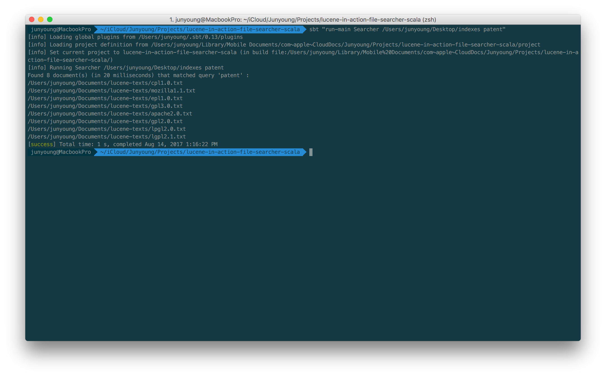

# lucene-in-action-file-searcher-scala
Lucene In Action 1장 예제 1.2 (루씬 색인을 검색하는 Searcher) java to scala
> Search from index with query

[First, you must make index files](https://github.com/sungjunyoung/lucene-in-action-file-indexer-scala)

### how to run
- usage  
`sbt "run-main Searcher <The directory in which includes index files> <Lucene query>"`
- example  
`sbt "run-main Searcher /Users/junyoung/Desktop/indexes patent"`

### result

